<h1 align="center">Currency Converter 💰</h1>

This is a program to convert currencies although unit conversion is also under development.

---

<h2>1. how to install?</h2>

1. You can clone the Github repository and run it on Intellij IDEA.
2. Copy the CurrencyConverter_Jar folder found in the path out/artifacts/ somewhere on your hard drive. Which contains the assets folder and the executable JAR file which are necessary for its execution.

---

<h2>2. How does it work?</h2>

- We load the respective connections and initial data recovery from the APIs. In the event of any disconnection with the internet or the APIs, the program ends.

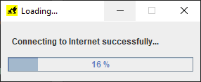
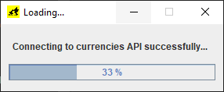
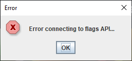

- Once inside the program we will be able to notice a main menu which gives us the options enabled to go to the currency conversion panel and exit the program.

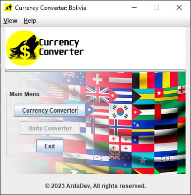

- At the top we have a JMenuBar which contains two menus View and Help. View presents us with navigation options to the different panels and the option to exit the program. Help shows us help options such as internet connection tests and APIs, we also have the option to show us information about the developer.

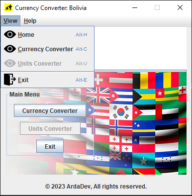
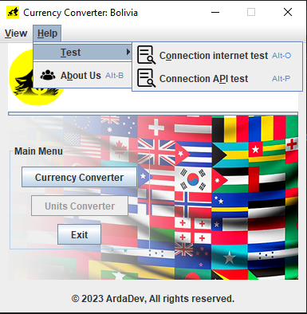
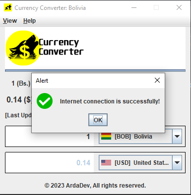
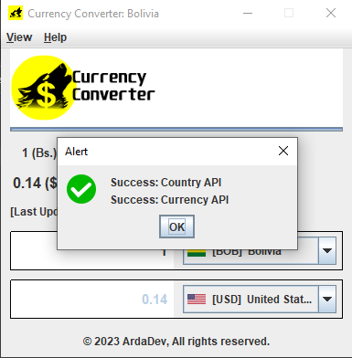
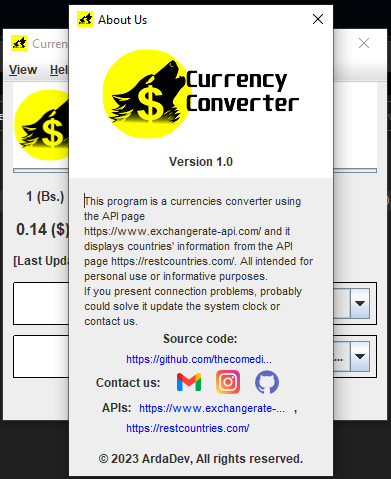

- Once inside the currency conversion panel, we can notice that the program first finds the country according to the configuration of your system, which can be seen in the title of the main JFrame, which it occupies to show the initial data with the Conversion to US dollars by default, if the country of the system is not found, it will also occupy the US dollars both in the currency and in the country.
- As output information we have three JLabels that show us the minimum unit of the currency of the selected or default country and the next JLabel represents the conversion unit of the currency to which we want to convert, the third JLabel shows the date of the last update of the information provided by the API and two last JLabel where we show the flags of the countries involved for the conversion query.
- As input data we have a JTextField which is validating only numeric data with two decimal places, as we introduce numbers it is converted automatically. The JLabels only show the minimum conversion of the countries involved. The results are shown in the JTexField that is disabled. The JLabels, including the one with the flags, contain additional information provided by the APIs, which are entered in their toolTipText attributes.

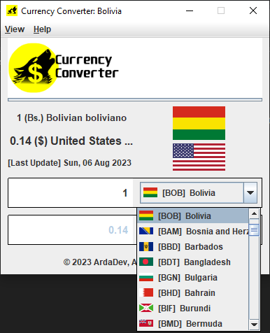
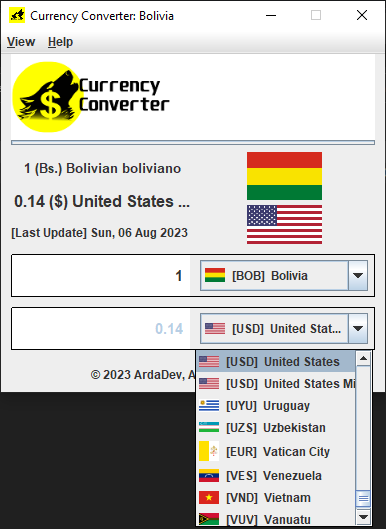

---

<h2>3. What APIs do you use?</h2>

- https://www.exchangerate-api.com/
- https://restcountries.com/

---

<h2>4. What did I do?</h2>

- Charge of resources.
- Network and API Connections validation.
- Use OOP to entities managment.
- Use Clean Arquitecture.
- Use library Gson from Google to serialize/deserialize JSON response.
- Use Regex to numeric input validations.
- Use Custom JComboBox.
- Implemented functions to resize images.

---
